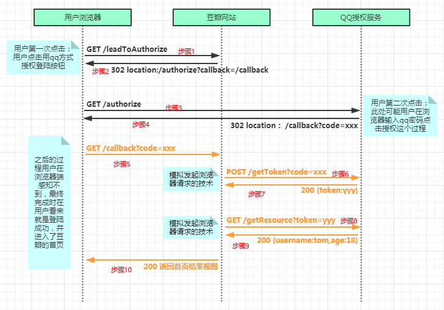

# OAuth2.0 协议

1. **名词定义**

   1. **Third-party Application**: 第三方应用程序，又称为客户端。本质是需要从资源服务器获得资源的程序。

   2. **HTTP Service ：HTTP**服务提供商，本文中简称服务提供商，即资源的存储方。

   3. **Resource Owner**：资源的所有者，一般是指用户。

   4. **User Agent**  ：用户代理，浏览器和用户设备上下载的app软件都可以当作是用户代理。

   5. **Authorization Server**：认证服务器，即服务提供商专门用来处理认证的服务器。

   6. **Resource Server**：资源服务器，即服务提供商专门用来存放用户生成的资源的服务器。他与认证服务器可以是同一台服务器，也可以是不同的服务器。

      Oauth的作用就是让**第三方应用程序**安全可控地获取**用户**在**服务提供商**一方的授权，与服务提供商进行互动。

2. **OAuth的思路**

   OAuth在客户端与服务提供商之间，设置了一个授权层（authorization layer），第三方客户端不能直接登录服务提供商（就是指第三方客户端没有获得用户在服务提供商这边账号的username和psw），只能登录到授权层，通过这种方式将用户和客户端区分开来（用户是使用username和pwd登录账号，而第三方客户端只有一个Token），用户可以在登录服务提供商的时候指定第三方客户端的权限范围和有效期。

3. **授权流程**

   

   整个流程大概如下：

   ​	* （重定向方式的含义是：页面通知浏览器发送一个新的页面请求。因为，当你使用重定向时，浏览器中所显示的URL会变成新页面的URL）

   1. 用户（Resource Owner）通过浏览器访问豆瓣网站，网站提示需要登录，用户选择使用qq第三方登录**【步骤1】**，这时豆瓣网站会发起重定向请求，通知浏览器请求QQAuthUrl这个地址（并带上一个参数DBcallbackUrl，用于授权成功后的回调）**【步骤2】**。
   2. 浏览器重定向到QQAuthUrl**【步骤3】**，用户在这个qq授权服务的界面完成对豆瓣的授权（可能需要输入qq账号密码），授权成功后，发起一个重定向请求，重定向到DBcallbackUrl并带上返回值code**【步骤4】**，至此用户可见的操作结束，在用户看来此时已经登录成功。
   3. 豆瓣获取到code之后，继续在后台发起模拟浏览器请求，做了两件事，一个是用拿到的code去换token，另一个就是用拿到的token换取用户信息。最后将用户信息储存起来，返回给浏览器其首页的视图**【步骤5-10】**。到此OAuth2.0流程授权结束。